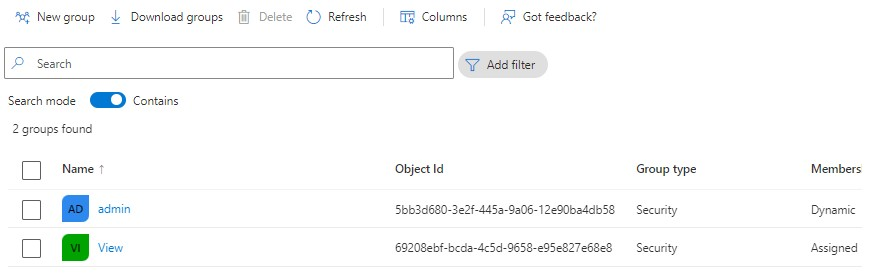
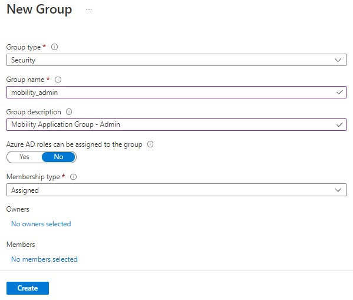
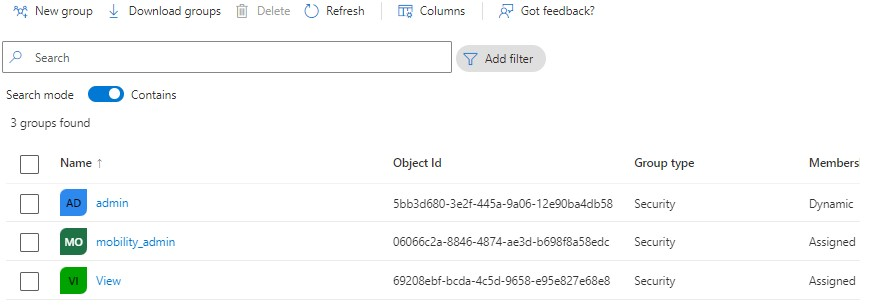
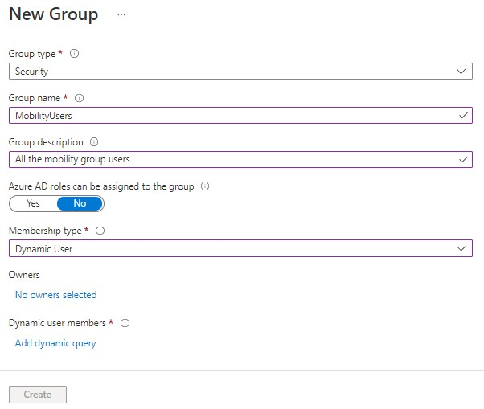
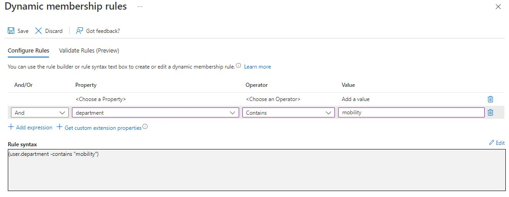
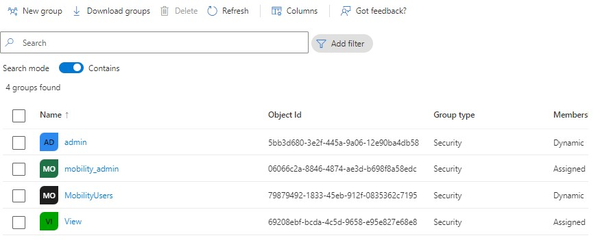

---
wts:
    title: '01 - Create group using Azure Active Directory (10 min)'   
    module: 'Module 01 - Azure Active Directory (Azure AD)'
---

# Objectives

In this lab, you will:

+ Task 1: Create an **assigned** group
+ Task 2: Create a **dynamic** group

# Lab 01: Create an assigned group using Azure Active Directory

 
You can create a basic group using the Azure Active Directory (Azure AD) portal. For the purposes of this article, a basic group is added to a single resource by the resource owner (administrator). For more complex scenarios, including dynamic memberships and rule creation, see the Azure [Active Directory user management documentation](https://docs.microsoft.com/en-us/azure/active-directory/enterprise-users/)

## Group and membership types
There are several group and membership types. The following information explains each group and membership type and why they are used, to help you decide which options to use when you create a group.

## Group types:
**Security**. Used to manage member and computer access to shared resources for a group of users. For example, you can create a security group for a specific security policy. By doing it this way, you can give a set of permissions to all the members at once, instead of having to add permissions to each member individually. A security group can have users, devices, groups and service principals as its members and users and service principals as its owners. For more info about managing access to resources, see [Manage access to resources with Azure Active Directory groups](https://docs.microsoft.com/en-us/azure/active-directory/fundamentals/active-directory-manage-groups)

**Microsoft 365**. Provides collaboration opportunities by giving members access to a shared mailbox, calendar, files, SharePoint site, and more. This option also lets you give people outside of your organization access to the group. A Microsoft 365 group can have only users as its members. Both users and service principals can be owners of a Microsoft 365 group. For more info about Microsoft 365 Groups, see [Learn about Microsoft 365 Groups](https://support.office.com/article/learn-about-office-365-groups-b565caa1-5c40-40ef-9915-60fdb2d97fa2)

## Membership types
**Assigned**. Lets you add specific users to be members of this group and to have unique permissions. For the purposes of this article, we're using this option.

**Dynamic user**. Lets you use dynamic membership rules to automatically add and remove members. If a member's attributes change, the system looks at your dynamic group rules for the directory to see if the member meets the rule requirements (is added) or no longer meets the rules requirements (is removed).

**Dynamic device**. Lets you use dynamic group rules to automatically add and remove devices. If a device's attributes change, the system looks at your dynamic group rules for the directory to see if the device meets the rule requirements (is added) or no longer meets the rules requirements (is removed).

## Task 01: Create a basic group
You can create a basic group and add your members at the same time; but in this task we will create just a Group. To create a basic group use the following procedure:

1. Sign in to the **Azure portal** using a Global administrator account for the directory.

2. Search for and select **Azure Active Directory**.

3. On the Active Directory page, select **Groups** and then select **New group**.

4. The New Group pane will appear and you must fill out the required information.

5. Select a pre-defined Group type **Security**.

6. Create and add a Group name. Choose a name that you'll remember and that makes sense for the group. A check will be performed to determine if the name is already in use by another group. If the name is already in use, to avoid duplicate naming, you'll be asked to change the name of your group.

7. **Group description**. Add an optional description to your group.

8. Select a pre-defined Membership type **Assigned** (required).

9.  Select **Create**. Your group is created and ready for you to add members.
    

# Lab 02: Create a dynamic group  using Azure Active Directory

In Azure Active Directory (Azure AD), you can use rules to determine group membership based on user or device properties. When a group membership rule is applied, user and device attributes are evaluated for matches with the membership rule. When an attribute changes for a user or device, all dynamic group rules in the organization are processed for membership changes. Users and devices are added or removed if they meet the conditions for a group. Security groups can be used for either devices or users, but Microsoft 365 Groups can be only user groups. Using Dynamic groups requires Azure AD premium P1 license or Intune for Education license. See [Dynamic membership rules](https://docs.microsoft.com/en-us/azure/active-directory/enterprise-users/groups-create-rule) for groups for more details.

## Rule builder in the Azure portal
Azure AD provides a rule builder to create and update your important rules more quickly. The rule builder supports the construction up to five expressions. The rule builder makes it easier to form a rule with a few simple expressions, however, it can't be used to reproduce every rule. If the rule builder doesn't support the rule you want to create, you can use the text box.

## Task 02: Create dynamic group

1. Sign in to the **Azure portal** using a Global administrator account for the directory.

2. Search for and select **Azure Active Directory**.

3. On the Active Directory page, select **Groups** and then select **New group**.
   
4. The New Group pane will appear and you must fill out the required information.
6. Create and add a Group name. Choose a name that you'll remember and that makes sense for the group. A check will be performed to determine if the name is already in use by another group. If the name is already in use, to avoid duplicate naming, you'll be asked to change the name of your group.

7. **Group description**. Add an optional description to your group.

8. Select a pre-defined Membership type **Dynamic** (required).
9. Select Add dynamic query; The rule builder supports up to five expressions. To add more than five expressions, you must use the text box.
10. Add a rule to include all the **mobility** department users to this group dynamically. After creating the rule, select **Save**.
    
11. Select Create on the New group page to create the group.
    

#### Review

In this lab, you have:

- Created an assigned group (Mobility Admin)
- Created a dynamic group (Mobility Users)

#### What's next?
- Create a user and assign to **mobility_admin**
- Set the user department to mobility so that the user gets added to **dynamic** group **MobilityUsers**
