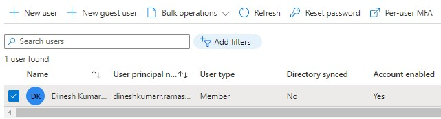
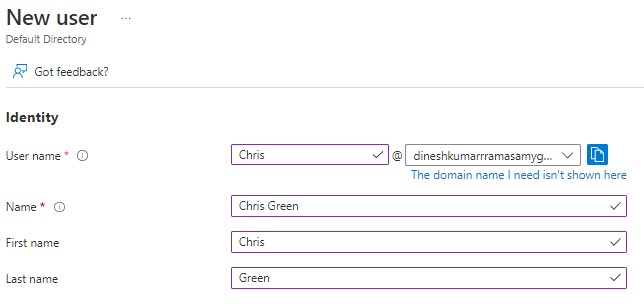
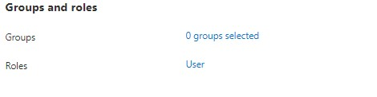
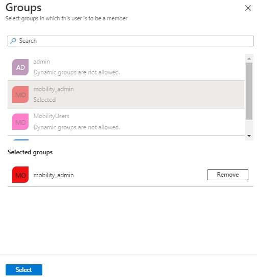
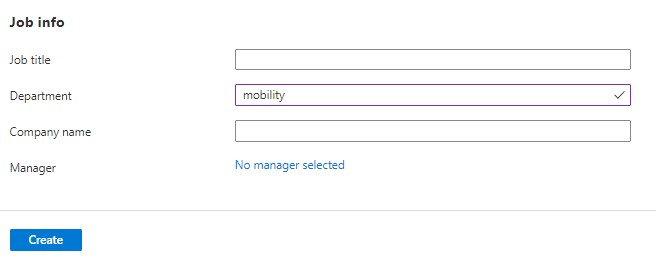
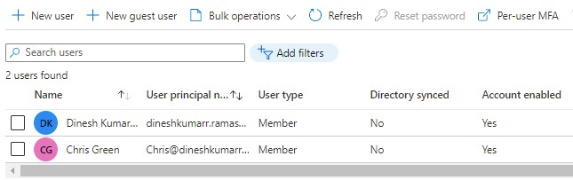
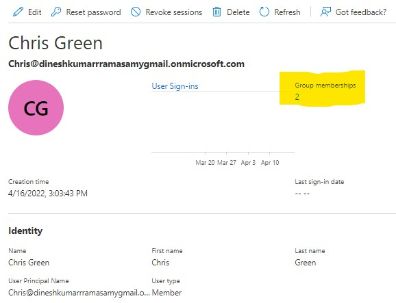
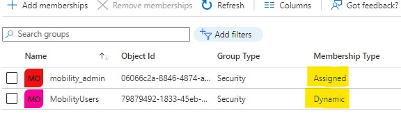

---
wts:
    title: '02 - Add and delete users using Azure Active Directory (10 min)'   
    module: 'Module 01 - Azure Active Directory (Azure AD)'
---

# Objectives

In this lab, you will:

Task 01:
- Create an **User** and assign to a group (**assigned**)
- Set the department name to **mobility** so that the user gets dynamically assigned to **MobilityUsers**
Task 02:
- Delete a User

# Lab 01 - Add and delete users using Azure Active Directory
Add new users or delete existing users from your Azure Active Directory (Azure AD) organization. To add or delete users you must be a User administrator or Global administrator.

# Task 01: Add a new user to Azure Active Directory
You can create a new user using the Azure Active Directory portal.
To add a new user, follow these steps:
1. Sign in to the **Azure portal** in the User Administrator role for the organization.

2. Search for and select **Azure Active Directory** from any page.

3. Select **Users**, , and then select **New user**.
   

4. On the User page, enter information for this user,
4.1 **Name**. Required. The first and last name of the new user. For example, Mary Parker.
4.2 **User name**. Required. The user name of the new user. 
4.3 Copy the autogenerated password provided in the Password box. You'll need to give this password to the user to sign in for the first time.
   
4.4 **Groups**. Optionally, you can add the user to one or more existing groups. You can also add the user to groups at a later time. 
4.5 Select a group for the user. 
4.6 **Job info**: You can add more information about the user here, or do it later. This user can be part of the **dynmaic** group you created in the previous lab by setting the department to **mobility** 

5. Select **Create**, refresh the user list.
   
   The user is created and added to your Azure AD organization.
6. Select the user to know how many groups he belongs to.

7. Select the **Groups** from the left menu to see the user's groups.
   

# Task 02: Delete a User
To delete a user, follow these steps:

1. Sign in to the Azure portal using a User administrator account for the organization.

2. Search for and select Azure Active Directory from any page.

3. Search for and select the user you want to delete from your Azure AD tenant. For example, Chril Green.

4. Select Delete user.

#### Review

In this lab, you have:

- Created an user and assigned to **mobility_admin**; and a dynamic assigmnent to **MobilityUsers** group
- Deleted the user account.
