---
wts:
    title: '03 - Create service principal (10 min)'   
    module: 'Module 01 - Azure Active Directory (Azure AD)'
---

# Objectives

In this lab, you will:

+ Task 01: Create a service principal
+ Task 02: Assign roles to the SP
  - Assign **Kubernetes Cluster - Azure Arc Onboarding** role
  - Assign **Azure Connected Machine Onboarding** role

# Lab 01: Create a Service Principal

This article shows you how to create a new Azure Active Directory (Azure AD) application and service principal that can be used with the role-based access control. When you have applications, hosted services, or automated tools that needs to access or modify resources, you can create an identity for the app. This identity is known as a service principal. Access to resources is restricted by the roles assigned to the service principal, giving you control over which resources can be accessed and at which level. For security reasons, it's always recommended to use service principals with automated tools rather than allowing them to log in with a user identity.

This article shows you how to use the portal to create the service principal in the Azure portal. It focuses on a single-tenant application where the application is intended to run within only one organization. You typically use single-tenant applications for line-of-business applications that run within your organization.

## Task 01: Create a Service Principal

Let's jump straight into creating the identity. If you run into a problem, check the [required permissions](https://docs.microsoft.com/en-us/azure/active-directory/develop/howto-create-service-principal-portal#permissions-required-for-registering-an-app) to make sure your account can create the identity.

1. Sign in to your Azure Account through the [Azure portal](https://portal.azure.com/).

2. Select Azure Active Directory.

3. Select App registrations. 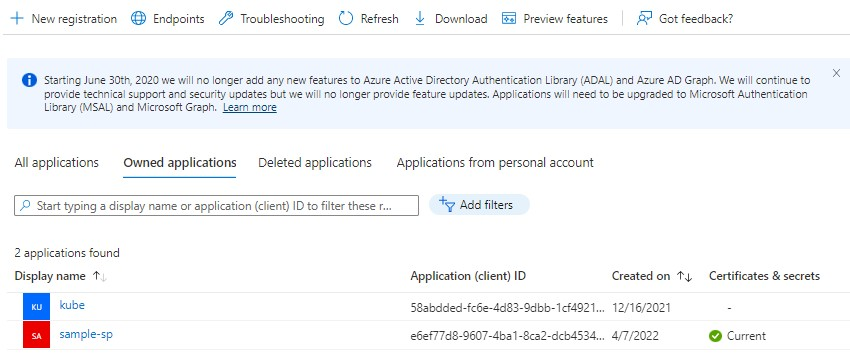

4. Select New registration. 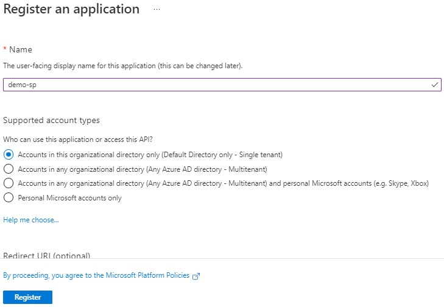

5. Name the application, select Register. 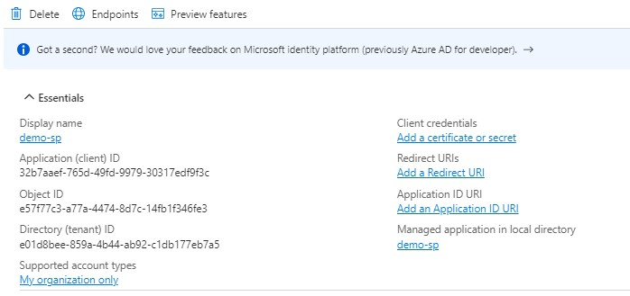
6. Select **Certificates & Secrets** from the left side menu. 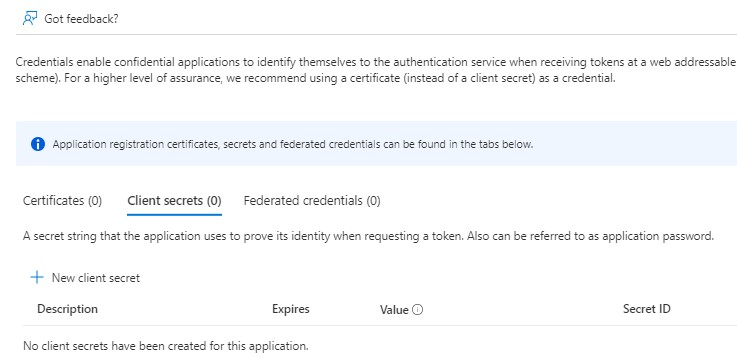
7. Select **New Client Secret**, enter and name and **Add** 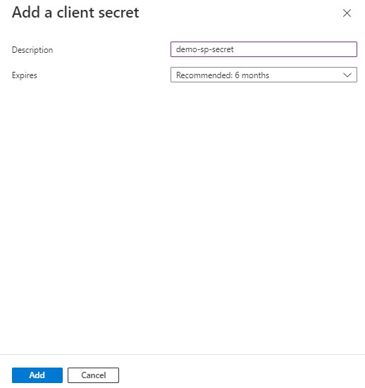
8. Copy the Client Secret. 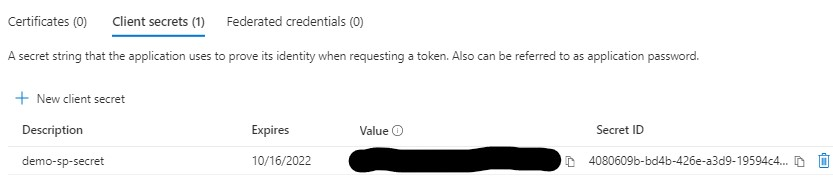

## Task 02: Assign roles to the Service Principal

- Permissions are grouped together into a role definition. It's typically just called a role. You can select from a list of several built-in roles. If the built-in roles don't meet the specific needs of your organization, you can create your own custom roles.
- Scope is the set of resources that the access applies to. In Azure, you can specify a scope at four levels: management group, subscription, resource group, and resource. Scopes are structured in a parent-child relationship. Each level of hierarchy makes the scope more specific. You can assign roles at any of these levels of scope.
- You can have up to 2000 role assignments in each subscription. This limit includes role assignments at the subscription, resource group, and resource scopes. You can have up to 500 role assignments in each management group.

## Steps

1. Sign in to the [Azure portal](https://portal.azure.com/).
2. Go to the ResourceGroup or Subscription and click **Access control (IAM)** from the left menu. 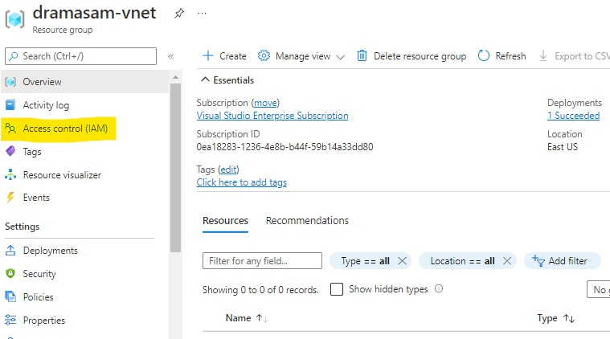 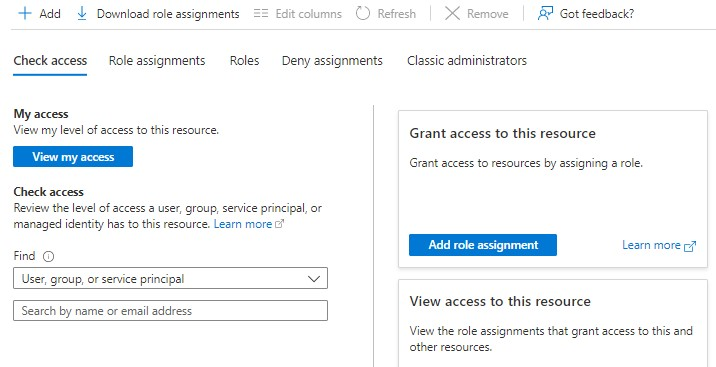
3. Click **Add role assignment** 
4. On the Roles tab, select a role that you want to use. 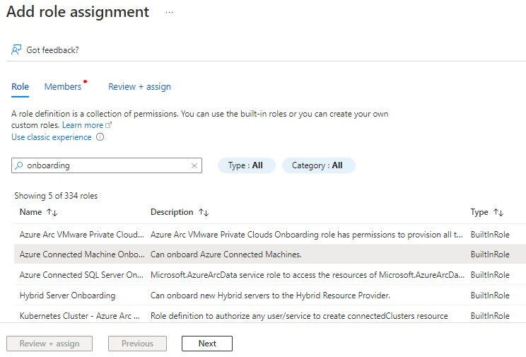
5. In the Details column, click View to get more details about a role. 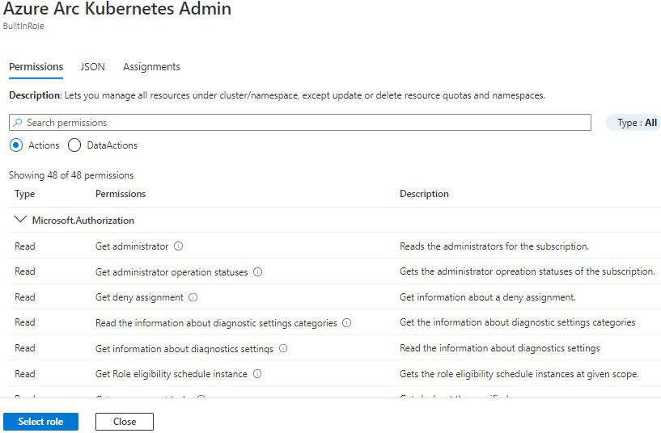
6. Click **Select role**, and Select Arc k8s onboarind role. 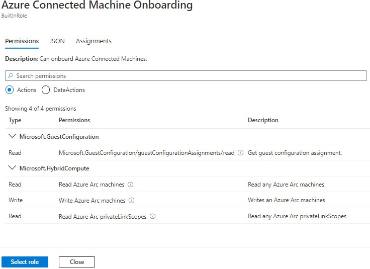 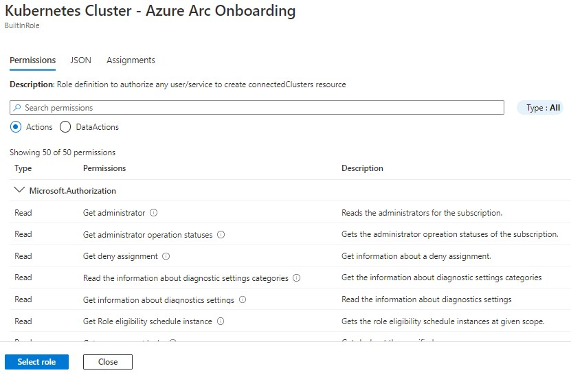
7. Click **Select role**
8.  On the Members tab, select **User, group, or service principal** to assign the selected role to one or more service principals (applications).
9.  Click **Select members**.
    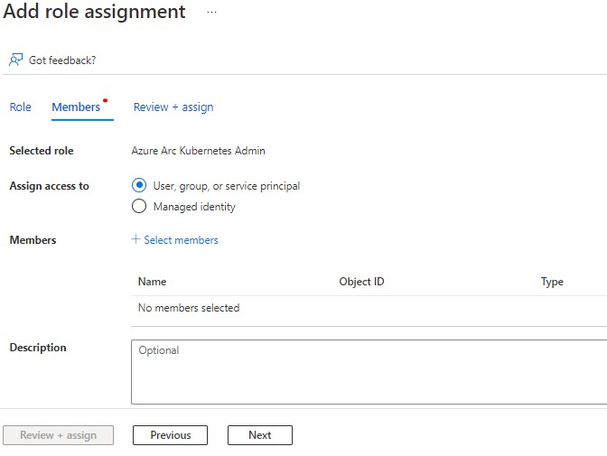
10. You can type in the **Select** box to search the service principal.
    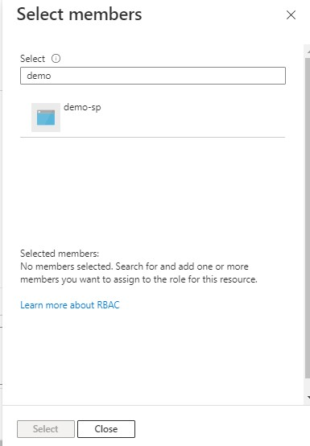
11. On the Review + assign tab, review the role assignment settings.
    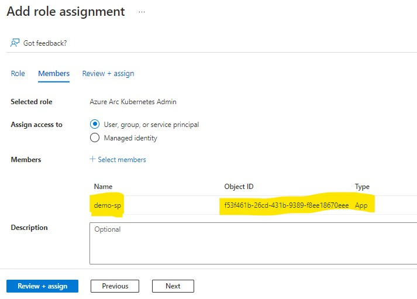
12. Click Review + assign to assign the role.
    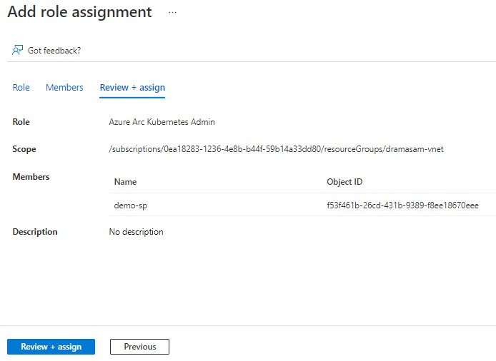

#### Review

In this lab, you have:

- Created an AAD application and added a secret.
- Assigned an Arc onboarding role to the Service Principal

# CLI Commands
1. Set variables
```
SERVICE_PRINCIPLE_NAME=`whoami`-arc-sp
RESOURCE_GROUP=`whoami`-arc
SUBSCRIPTION_ID=`az account show --query id --output tsv`
```
2. Create Resource Group
```
az group create --name $RESOURCE_GROUP --location $LOCATION
```

3. Create Service Principle and store the secret
```
    servicePrincipalSecret=`az ad sp create-for-rbac \
                                --name $SERVICE_PRINCIPLE_NAME \
                                --role "Azure Connected Machine Onboarding" \
                                --scopes /subscriptions/${SUBSCRIPTION_ID}/resourceGroups/${RESOURCE_GROUP} \
                                --years 1 \
                                --output tsv \
                                --query password`
```
4. Get the SP client ID 
```
    servicePrincipalClientId=`az ad app list \
                                --display-name $SERVICE_PRINCIPLE_NAME \
                                --query [].appId -o tsv`
```

5. Assign roles
```
    az role assignment create \
        --assignee $servicePrincipalClientId \
        --role "Kubernetes Cluster - Azure Arc Onboarding" \
        --scope /subscriptions/${SUBSCRIPTION_ID}/resourceGroups/${RESOURCE_GROUP}

    az role assignment create \
        --assignee $servicePrincipalClientId \
        --role "Azure Connected Machine Onboarding" \
        --scope /subscriptions/${SUBSCRIPTION_ID}/resourceGroups/${RESOURCE_GROUP}
```
