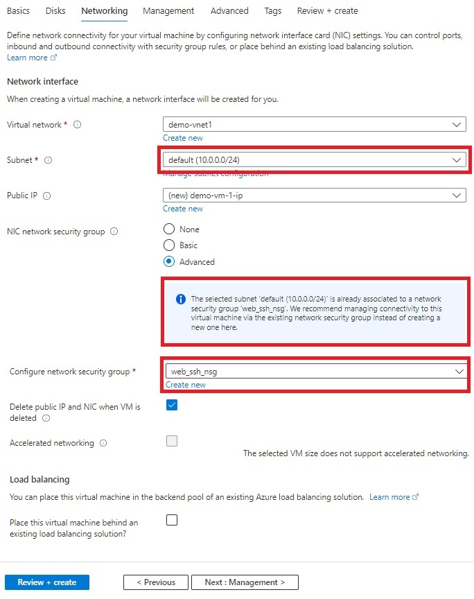

---
wts:
    title: '01 - Create VMs using Azure Portal and CLI (10 min)'   
    module: 'Module 03 - Azure Compute'
---

# Objectives

In this lab, you will:

+ Task 01: Create two Virtual Machines using Azure Portal
+ Task 02: Connect to the Virtual Machines
+ Task 03: Ping VM1 (default subnet) IP from VM2 (subnet2)
+ Task 04: Create Virtual Machines using CLI

# Lab 01: Create and connect to VMs

## Task 01: Create two VMs with different subnets using Azure Portal

1. Sign-in to the Azure portal: **https://portal.azure.com**

2. From the **All services** blade in the Portal Menu, search for and select **Virtual machines**, and then click **+Add, +Create, +New** and choose **+Virtual machine** from the drop down.

3. On the **Basics** tab, fill in the following information (leave the defaults for everything else):
   + Use ~/.ssh/id_rsa.pub from your laptop/server instaed of creating a new key.
   

4. Switch to the Networking tab and select the **Virtual Netwok**, default **subnet** and **Network Security Group** created in the previous lab. 

5. Leave the remaining values on the defaults and then click the **Review + create** button at the bottom of the page. 

6. Once Validation is passed click the **Create** button. It can take anywhere from five to seven minutes to deploy the virtual machine.

7. Explore the virtual machine public and private IP addtess from it's details. 

    >**Note**: Create another Virtual Machine with demo-vnet1/subnet2.

## Task 02: Connect to the VM

In this task, we will connect to our new virtual machine using SSH. 

1. On the virtual machine two **Overview** blade, click **Connect** button and choose **SSH** from the drop down.

2. Follow the instructions to SSH into VM2.

## Task 03: Ping VM1 (default subnet) IP from VM2 (subnet2)

1. Try to ping VM1 IP from VM2. You should be successful. You have pinged VM2 from VM1. 

## Task 04: Create Virtual Machines using CLI

## CLI Commands

1. Clone this git repo
    ```
    git clone https://github.com/dramasamy/training.git
    ```
2. Login to your Azure account
    ```
    az login
    ```
3. Set a subscription to be the current active subscription.
    ```
    az account set --subscription <subscription-id>
    ```
4. Go to the azue/vnet directory
    ```
    cd training/azure/vnet
    ```

5. Open the script `create_vms_with_diff_subnet.sh` to explore the commands. 

6. Execute `./create_vms_with_diff_subnet.sh` to create a vnet with two subnets.

#### Review

In this lab, you have:

- Created two Virtual Machines using Azure Portal
- Connected to the Virtual Machines using SSH
- Pinged VM1 from VM2
- Created two VMs using CLI
