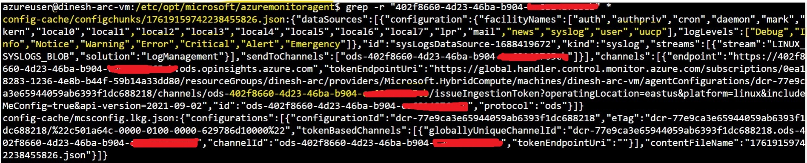

---
wts:
    title: '01 - Install and Configure Azure Monitoring Agent (10 min)'   
    module: 'Module 05 - Logging and Monitoring'
---

# Objectives

In this lab, you will:

+ Task 1: Create a **Log Analytics Workspace**
+ Task 2: Create a **Data Collection Rule** and associate it to the **Arc Connected Server's** AMA using **DCR Rule**

# Prerequisites
1. Arc Connected server
   + Clone this git repo from Azure **cloud shell**. If this repo already exists in your shell, please **git pull**.
        ```
        git clone https://github.com/dramasamy/training.git
        ```
   + Go to the azue/arc directory
        ```
        cd training/azure/arc
        ```
        
   + Ensure there is an SSH key in the cloud shell; if not, execute **ssh-keygen** to generate SSH keys as this will be used to SSH into the VM.
        ```
        ssh-keygen
        ```
 
   + Execute the following command to create an Azure VM, Arc Connect, Create Kind Cluster and Arc connect Kind cluster.
        ```
        ./arc_enroll_k8s_and_server.sh
        ```

    >**Note**: This script will create ./cleanup.sh and that can be used at the end of the lab to delete all the resources.

# Lab 01: Create a Log Analytics Workspace and DCR
 
Use the Log Analytics workspaces menu to create a Log Analytics workspace in the Azure portal. Log Analytics workspace is the environment for Azure Monitor log data. Each workspace has its own data repository and configuration, and data sources and solutions are configured to store their data in a particular workspace. A workspace has unique workspace ID and resource ID. You can reuse the same workspace name when in different resource groups. You require a Log Analytics workspace if you intend on collecting data from the following sources:

+ Azure resources in your subscription
+ On-premises computers monitored by System Center Operations Manager
+ Device collections from Configuration Manager
+ Diagnostics or log data from Azure storage

## Task 01: Create a Log Analytics Workspace
You can create a basic group and add your members at the same time; but in this task we will create just a Group. To create a basic group use the following procedure:

1. Sign in to the **Azure portal**.

2. In the Azure portal, click All services. In the list of resources, type Log Analytics. As you begin typing, the list filters based on your input. Select Log Analytics workspaces.

3. Click **Create**


4. Provide values for the following options:
   + Select a Subscription to link to by selecting from the drop-down list if the default selected is not appropriate.
   + For Resource Group, choose to use an existing resource group already setup in the **pre-req step**
   + Provide a name for the new Log Analytics workspace, such as DefaultLAWorkspace. This name must be unique per resource group.
   + Select an available Region.


5. Review and Create.


6. Go to the resource and explore the properties.


## Task 02: Create DCR and associate it to the VM (AMA)

You can use the Azure portal to create a data collection rule and associate virtual machines in your subscription to that rule. The Azure Monitor agent will be automatically installed and a managed identity created for any virtual machines that don't already have it installed.

Data Collection Rules (DCRs) in Azure Monitor define the way that data coming into Azure Monitor should be handled. Some data collection rules will be created and managed by Azure Monitor, while you may create others to customize data collection for your particular requirements.

A DCR for Azure Monitor agent contains the following sections:

### Data sources

Unique source of monitoring data with its own format and method of exposing its data. Examples of a data source include Windows event log, performance counters, and syslog. Each data source matches a particular data source type as described below. 

Each data source has a data source type. Each type defines a unique set of properties that must be specified for each data source. The data source types currently available are shown in the following table.

| Data source type | Description | 
|:---|:---|
| extension | VM extension-based data source, used exclusively by Log Analytics solutions and Azure services |
| performanceCounters | Performance counters for both Windows and Linux |
| syslog | Syslog events on Linux |
| windowsEventLogs | Windows event log |

### Destinations
Set of destinations where the data should be sent. Examples include Log Analytics workspace and Azure Monitor Metrics. Multiple destinations are allowed for multi-homing scenario.


1. Sign in to the **Azure portal**.

2. In the Azure portal, click All services. In the list of resources, type Monitor. As you begin typing, the list filters based on your input. Select Monitor.
   
3. In the Monitor menu in the Azure portal, select Data Collection Rules from the Settings section. 
   
4. Click Create to create a new Data Collection Rule and assignment. Provide a Rule name and specify a Subscription, Resource Group and Region. This specifies where the DCR will be created. The virtual machines and their associations can be in any subscription or resource group in the tenant. Additionally, choose the appropriate Platform Type which specifies the type of resources this rule can apply to. 

    >**Note**: If you wish to send data to Log Analytics, you must create the data collection rule in the same region where your Log Analytics workspace resides. The rule can be associated to machines in other supported region(s)..

5. In the Resources tab, add the resources (virtual machines, virtual machine scale sets, Arc for servers) that should have the Data Collection Rule applied. The Azure Monitor Agent will be installed on resources that don't already have it installed, and will enable Azure Managed Identity as well. 


6. On the Collect and deliver tab, click Add data source to add a data source and destination set. Select a Data source type, and the corresponding details to select will be displayed. 


7. On the Destination tab, add one or more destinations for the data source. You can select multiple destinations of same of different types, for instance multiple Log Analytics workspaces (i.e. "multi-homing").


8. Click Add Data Source and then Review + create to review the details of the data collection rule and association with the set of VMs. Click Create to create it.


9. Explore Data sources and Linked Resources (VM) from the DCR page.


10. Login to the VM and gerp for **azuremonitoagent** to ensure that the AMA is running.

11. Go to **/etc/opt/microsoft/azuremonitoragent/** and grep for Log Analytics Workspace ID to find the config file; explore the config. 

12. Check the extension status from the Arc connected server page. 
    
13. Go the **Monitoring** section of Arc connected server's menu and click **Logs** to execute HeartBeat query to view the HB messages from the AMA agent. 

14. Search 'syslog' in the query filter and run 'All Syslog' query. 


#### Review

In this lab, you have:

- Created a **Log Analytics Workspace**
- Created a a **Data Collection Rule** and associate it to the **Arc Connected Server's** AMA using **DCR Rule**
