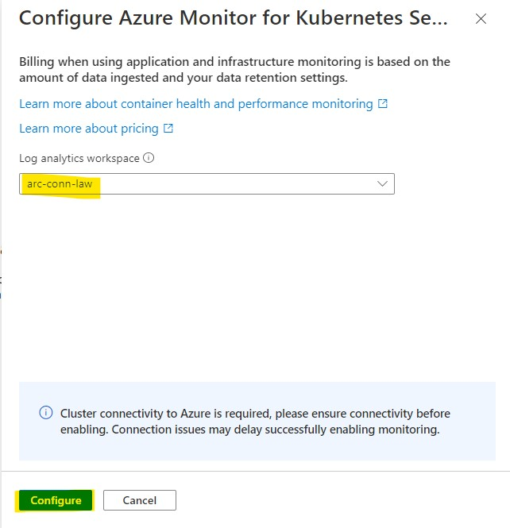

---
wts:
    title: '02 - Install and Configure Container Insights (10 min)'   
    module: 'Module 05 - Logging and Monitoring'
---

# Objectives

In this lab, you will:

+ Task 1: Install Azure Monitor (Container Insights) on the **Arc Connected K8s Cluster**

# Prerequisites
+ Log Analytics workspace
+ Arc connected K8s cluster
+ Service account bearer token (https://docs.microsoft.com/en-us/azure/azure-arc/kubernetes/cluster-connect#service-account-token-authentication-option)

# Lab 01: Install Azure Monitor (Container Insights)

1. In the Azure portal, select the Azure Arc-enabled Kubernetes cluster that you wish to monitor. 

2. Select the **Insights** item under the **Monitoring** section of the resource blade. 

3. On the onboarding page, select the **Configure Azure Monitor** button. !

4. You can now choose the Log Analytics workspace to send your metrics and logs data to. 

5. Select the 'Configure' button to deploy the Azure Monitor Container Insights cluster extension. 

6. Once you have successfully created the Azure Monitor extension for your Azure Arc-enabled Kubernetes cluster, you can additionally check the status of installation using 'Extensions' option. Successful installations should show the status as 'Installed'.Go to the 'Workloads' and filter the Pods in 'kube-system' namespace. 

7. Browse container 'insights'

#### Review

In this lab, you have:

- Installed Azure Monitor (Container Insights) on the Arc connected k8s cluster.
