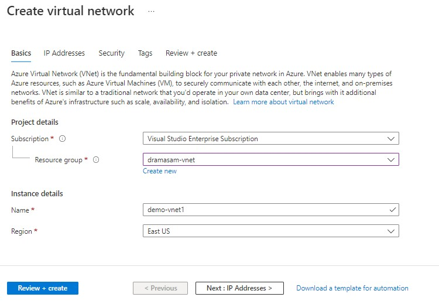
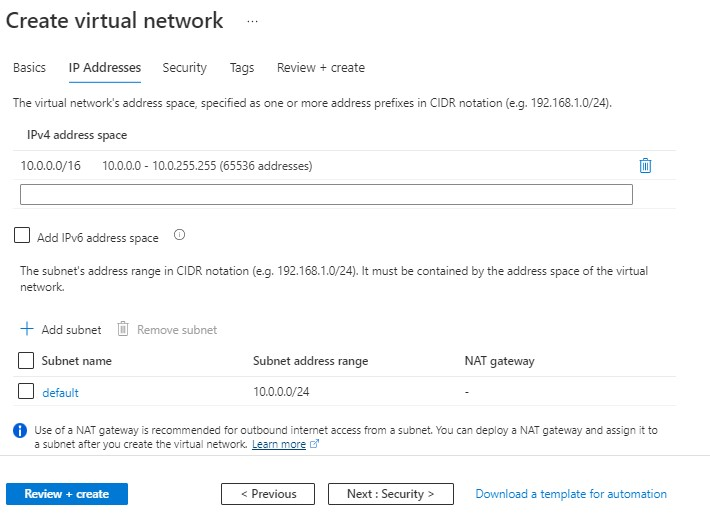
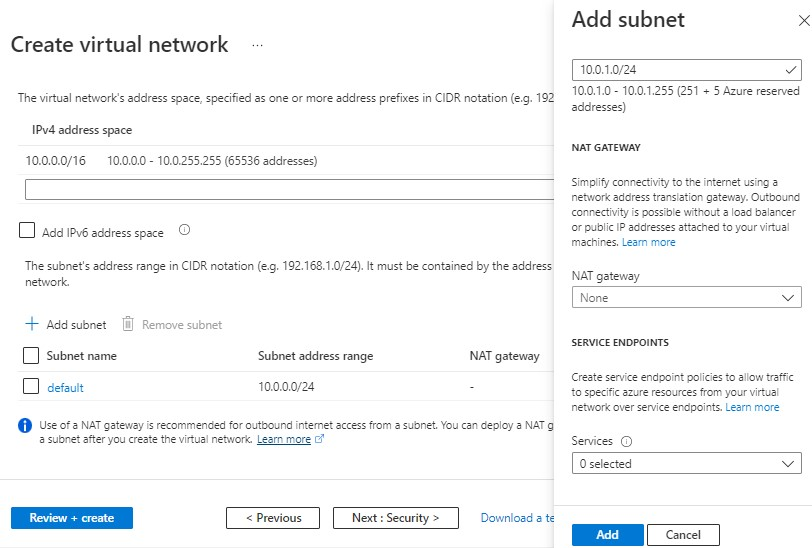
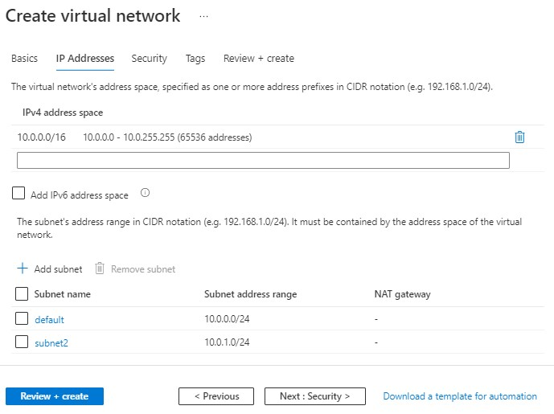
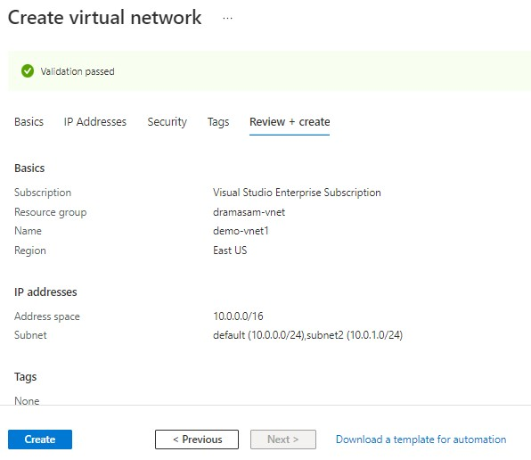
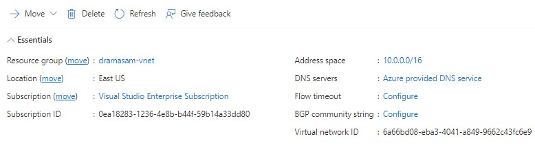

---
wts:
    title: '01 - Create Virtual Network (10 min)'   
    module: 'Module 02 - Azure Virtual Network'
---

# Objectives

In this lab, you will:

+ Task 01: Create a **vnet** with two **subnets**.

# Lab 01: Create a virtual network using the Azure portal

A virtual network is the fundamental building block for your private network in Azure. It enables Azure resources, like VMs, to securely communicate with each other and with the internet. In this lab, you learn how to create a virtual network using the Azure portal.


## Task 01: Create a virtual network

1. Sign in to the [Azure portal](https://portal.azure.com).

2. Select **Create a resource** in the upper left-hand corner of the portal. 

3. In the search box, enter **Virtual Network**. Select **Virtual Network** in the search results.

4. In the **Virtual Network** page, select **Create**.

5. In **Create virtual network**, enter the required information. 

6. Select the **IP Addresses** tab, or select the **Next: IP Addresses** button at the bottom of the page. 

7. Select **+ Add subnet**, then enter **subnet2** for **Subnet name** and **10.0.1.0/24** for **Subnet address range**. Adding this extra subnet helps to create two VMs with different subnet and ping between them. In Azure, ping between two subnets within a vnet is allowed by default. 

8. Select **Add**. 
   
9.  Select the **Review + create** tab or select the **Review + create** button. 

10.  Select **Create** and check vNET details. 

#### Review

In this lab, you have:

- Created a vnet with two subnets.

## CLI Commands

1. Clone this git repo
    ```
    git clone https://github.com/dramasamy/training.git
    ```
2. Login to your Azure account
    ```
    az login
    ```
3. Set a subscription to be the current active subscription.
    ```
    az account set --subscription <subscription-id>
    ```
4. Go to the azue/vnet directory
    ```
    cd training/azure/vnet
    ```

5. Open the script `create_vnet_cli.sh` to explore the commands. 

6. Execute `./create_vnet_cli.sh` to create a vnet with two subnets.
