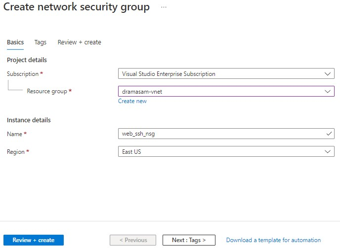
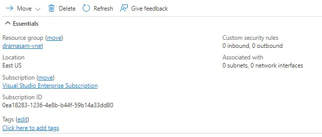
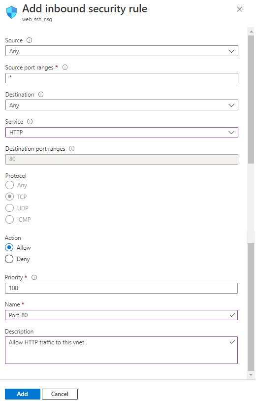
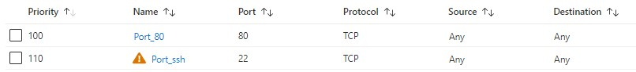
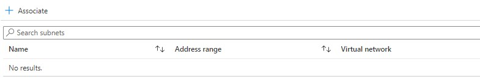
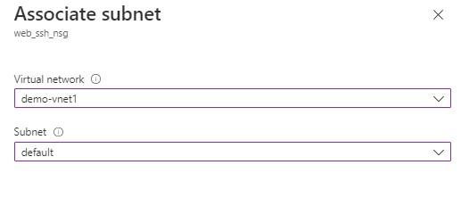
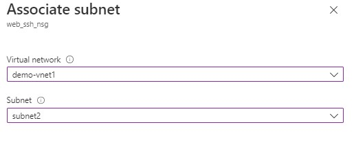
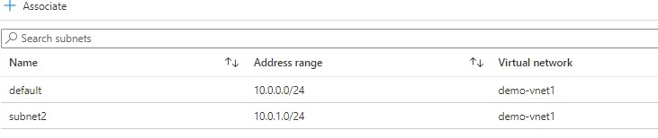

---
wts:
    title: '02 - Create NSG and associate to subnet (5 min)'   
    module: 'Module 02 - Azure Virtual Network'
---

# Objectives

In this lab, you will:

+ Task 01: Create a **Network Security Group**
  
+ Task 02: Assign NSG to the  **subnets**

# Lab 01: Create a Network Security Group using the Azure portal

You can use an Azure network security group to filter network traffic to and from Azure resources in an Azure virtual network. A network security group contains security rules that allow or deny inbound network traffic to, or outbound network traffic from, several types of Azure resources. For each rule, you can specify source and destination, port, and protocol.

## Task 01: Create a Network Security Group

1. In the Azure portal, search for and select **Network security groups**, and, on the **Network security groups** blade, click **+ Create**. 

2. Create a network security group with the following settings (leave others with their default values) 

3. Click **Review and Create**. Let validation occur, and hit **Create** to submit your deployment.
    >**Note**: Wait for the deployment to complete. This should take about 2 minutes.

4. On the deployment blade, click **Go to resource** to open the network security group blade. 

5. On the network security group blade, in the **Settings** section, click **Inbound security rules**. 

6. Add an inbound rule with the following settings (leave others with their default values) 

    Add an another rule for **SSH** port 22. 

    >**Note**: SSH port 22 is exposed to the Internet. This is only recommended for testing. For production environments, we recommend using a VPN or private connection.

7. List and verify inbound rules. 

## Task 02: Associate a Network Security Group to Subnet using Azure Portal

NSGs can be associated with subnets or individual virtual machine instances within that subnet. When an NSG is associated with a subnet, the ACL rules apply to all Virtual Machine instances of that subnet. In addition, you can further restrict traffic to an individual virtual machine by associating an NSG directly to that virtual machine.

All network security groups contain a set of default rules. You cannot delete the default rules, but since they are assigned the lowest priority, they can be replaced by the rules you create.

### Levels of Association
+ Association of a network security group to a virtual machine:
  + When you associate a network security group with a VM, the network access rules of the network security group apply to all traffic that enters and leaves the VM.

+ Association of a network security group to a NIC:
  + By associating a network security group with a NIC, the network access rules of the network security group apply only to that NIC. This means that in a virtual machine with several NICs, the fact that a network security group applies to a single NIC does not affect the traffic linked to other NICs.
+ Association of a network security group to a subnet:
  + When associating a network security group with a subnet, the network access rules of the network security group are applied to all the IaaS and PaaS resources of the subnet.

1. On the **web_ssh_nsg** network security group blade, in the **Settings** section, click **Subnets** and then click **+ Associate**. 

2. Associate NSG to **default** subnet. 

3. Associate NSG to **subnet2** subnet. 

4. List and check the associated subnets. 

#### Review

In this lab, you have:

- Created a **Network Security Group**
  
- Assigned NSG to the  **subnets**; in the next lab we will assign the NSG to VMs